# Code GYM - Code LLM

**Code GYM - Code LLM** is a hands-on coding platform powered by Large Language Models (LLMs) designed to help learners practice programming and receive intelligent assistance while solving real-world problems. It blends structured course content with dynamic AI features to enhance the coding learning experience.

## Features

- 🌟 **Interactive Code Editor** with real-time feedback  
- 🤖 **LLM-powered Assistance**:  
  &nbsp;&nbsp;&nbsp;&nbsp;- Progressive Hints System  
  &nbsp;&nbsp;&nbsp;&nbsp;- Error Explanation  
  &nbsp;&nbsp;&nbsp;&nbsp;- Test Case Generation  
  &nbsp;&nbsp;&nbsp;&nbsp;- Code Review Assistant  
  &nbsp;&nbsp;&nbsp;&nbsp;- Conceptual Scaffolding  
- 📚 **Topic-Based Courses**:  
  &nbsp;&nbsp;&nbsp;&nbsp;- Python and JavaScript programming  
  &nbsp;&nbsp;&nbsp;&nbsp;- Each topic contains structured problems with difficulty levels  
- ⚙️ **Auto-Graded Code Execution** via Docker sandboxing  
- 📄 **Fully YAML-Driven Content** — no databases required  

## Tech Stack

- **LLM Runner**: Ollama  
- **LLM Model**: `qwen2.5:7b` (hosted locally via Ollama)  
- **Backend Framework**: FastAPI  
- **Frontend Framework**: HTML, CSS, JS  
- **Course Config**: Single `config.yaml` file (contains all course and question metadata)  
- **Orchestration & Logging**: Prefect / DBOS + MLflow  
- **Code Execution**: Docker-based secure execution for user-submitted code  

## Course Content Structure

- Each course (Python, JS) includes 5 topics  
- Every topic contains 6 problems:  
  &nbsp;&nbsp;&nbsp;&nbsp;- Metadata: ID, title, difficulty, etc.  
  &nbsp;&nbsp;&nbsp;&nbsp;- Starter code & solution  
  &nbsp;&nbsp;&nbsp;&nbsp;- Public and hidden test cases  
- All content is defined in YAML for easy authoring and versioning  

---

Start coding, learn smarter, and level up your skills with **Code GYM - Code LLM**.

### *Firstly ensure that you have installed ollama on your machine and have pulled(hosted) the qwen2.5:7b model in it.*

---

## How to Run the Project

To run the **Code Gym Project**, follow these steps:

### **1. Setup the Environment**

Clone the repository and install the dependencies:

```bash
git clone https://github.com/Devansh-Kesan/Code-Gym-Project.git
```

### **2. Before running following command Please ensure just is already installed in your system**

```bash
just setup  
```

---

### **3. Creating the required docker images(Ensure you have docker desktop already installed)**
Create the images to run python and javascript codes in docker:
```
bash
just build-docker-images
```

### **4. Running the Application**

You can directly run the application using following command:
```bash
just start-all
```
**This will start the prefect,backend and frontend at once and Now you can open `http://localhost:9000` in your browser to view the running application.**

If you want you can also run the backend,frontend and prefect all seperately using following commands.

#### Run the Backend

Start the backend server using FastAPI:
```bash
just start-backend-server
```
This will start the backend server, which powers the core functionality of the system.

#### Run the Frontend

Start the frontend interface using HTML CSS and Javascript:
```bash
just start-frontend-server
```
This will launch the frontend, allowing you to interact with the system via a web interface.

#### Run the Prefect Server

Start the prefect server:
```bash
just start-prefect-server
```
This will launch the Prefect UI, allowing you to interact with and monitor flows through a web-based interface.

**Now open `http://127.0.0.1:9000` in your browser to view the running application.**


### **5. Run MkDocs for Documentation**

To view the project documentation locally, run MkDocs:
```bash
just documentation
```
This will start a local server where you can view the project documentation in your browser.

# System Architecture

## Overview
Code GYM - Code LLM is designed as a modular, YAML-driven learning platform enhanced with LLM-based agent capabilities. It combines static course content with dynamic AI interactions, enabling users to receive real-time coding support.

## Architecture Components

1. **Frontend (React)**  
   &nbsp;&nbsp;&nbsp;&nbsp;- Displays course, topic, and question content dynamically  
   &nbsp;&nbsp;&nbsp;&nbsp;- Code editor built with CodeMirror for real-time coding  
   &nbsp;&nbsp;&nbsp;&nbsp;- Communicates with backend APIs to fetch data and get LLM-powered assistance

2. **Backend (FastAPI)**  
   &nbsp;&nbsp;&nbsp;&nbsp;- Serves course data from a central `config.yaml`  
   &nbsp;&nbsp;&nbsp;&nbsp;- Manages code execution using Docker containers  
   &nbsp;&nbsp;&nbsp;&nbsp;- Integrates with LLMs via Ollama to provide smart features

3. **LLM Agent System**  
   &nbsp;&nbsp;&nbsp;&nbsp;- Handles user queries (e.g. ask for a hint, explain an error)  
   &nbsp;&nbsp;&nbsp;&nbsp;- Chooses appropriate agent tools (e.g. Hint Generator, Code Reviewer)  
   &nbsp;&nbsp;&nbsp;&nbsp;- Uses models like `qwen2.5:3b` for response generation

4. **Code Execution Engine**  
   &nbsp;&nbsp;&nbsp;&nbsp;- Executes submitted code securely in a Docker sandbox  
   &nbsp;&nbsp;&nbsp;&nbsp;- Evaluates test cases (including hidden ones) and returns results

5. **Orchestration & Logging**  
   &nbsp;&nbsp;&nbsp;&nbsp;- MLflow logs user interaction and model outputs  
   &nbsp;&nbsp;&nbsp;&nbsp;- Prefect / DBOS used for managing execution flows


## Flow Diagram

```mermaid
graph TD;
    User["🧑 Learner"] -->|Selects Question / Submits Code| Frontend["💻 Frontend"];
    Frontend -->|Fetches Data| Backend["🧠 Backend (FastAPI)"];
    Backend -->|Loads from YAML| Config["📄 config.yaml"];
    Backend -->|Submits Code| Executor["🐳 Docker Sandbox"];
    Executor -->|Returns Results| Backend;
    Backend -->|Calls LLM Tool| LLM["🤖 LLM via Ollama"];
    LLM -->|Responds with Hint / Review / Explanation| Backend;
    Backend -->|Returns Feedback & Test Results| Frontend;
    Frontend -->|Displays Output| User;
```


# **Functionality**

## 1. Progressive Hints System  
- Provides step-by-step hints based on the learner’s current code.  
- Hints are generated dynamically by analyzing the logic and structure of the submitted solution.  
- Helps users gradually reach the final solution without directly revealing it.  

## 2. Error Explanation  
- Explains runtime or logical errors in the user’s code.  
- The LLM identifies common mistakes and describes them in plain language.  
- Often includes suggestions or corrections to guide the user.  

## 3. Test Case Generation  
- Automatically generates additional test cases based on the problem description and user code.  
- Ensures broader coverage and edge case handling.  
- Helps learners test their code beyond the provided examples.  

## 4. Code Review Assistant  
- Reviews the submitted code and provides feedback on style, structure, and efficiency.  
- Suggests improvements while maintaining the original logic.  
- Encourages clean, readable, and optimized code practices.  

## 5. Conceptual Scaffolding  
- Offers brief explanations of relevant concepts based on user queries or stuck points.  
- Useful for bridging knowledge gaps without having to leave the platform.  
- Acts like a just-in-time tutor for coding concepts and problem-solving strategies.  

## 6. Secure Code Execution  
- Executes user-submitted code within isolated Docker containers.  
- Ensures a safe and consistent environment for running code and evaluating test cases.  
- Includes support for public and hidden test cases to validate learning outcomes.  

## 7. YAML-Driven Content Management  
- All courses, topics, and problems are defined in a single `config.yaml` file.  
- Easily editable and version-controlled without requiring a database.  
- Supports structured metadata, starter code, test cases, and solutions for each problem.

## 8. LLM Orchestration  
- All features are powered by the `qwen2.5:7b` LLM model hosted via **Ollama**.  
- Prefect/DBOS handles orchestration of requests and MLflow logs all LLM interactions.

# Learnings & Challenges

## Challenges Faced

### 1. Latency Issues
- Some LLM-powered features (like code review and test case generation) had higher latency due to model response time.
- Required tuning the way data is passed and received from the LLM backend.

### 2. Prompt Quality & Output Control
- Crafting clear, consistent prompts for each tool (Hint Generator, Error Explainer, etc.) was tricky.
- Even small changes in wording could lead to drastically different or irrelevant outputs.

### 3. Code Execution Environment
- Ensuring secure, reproducible Docker containers for user code execution involved fine-tuning image setup and resource management.
- Also had to handle edge cases like infinite loops or excessive memory usage gracefully.

### 4. Model Evaluation
- Tried various models (e.g., `LLaMA 3.2`, `Qwen2.5:3b`) to evaluate quality, response speed, and cost-effectiveness.
- Settled on `Qwen2.5:3b` via Ollama due to its balance of reliability and performance.

## Key Learnings

### LLM Tool Isolation
- Treating each LLM-powered feature as a separate tool made debugging and prompt tuning easier.
- This modularity helped with maintenance and future scalability.

### Frontend-Backend Sync
- Building a smooth experience required tight integration between frontend events (e.g., clicking “Hint”) and backend endpoints.
- Standardized response formats helped display results consistently in the UI.

### Efficient Code Execution Pipeline
- Docker containers were optimized to quickly spin up, run code, and tear down with minimal overhead.
- Logs and test case evaluations were made transparent for better debugging and feedback.

### Improved Observability
- Added detailed logging for LLM requests, user actions, and code results using MLflow and Prefect/DBOS.
- Helped track tool usage patterns and fine-tune performance.
