# System Architecture

## Overview
Code GYM - Code LLM is designed as a modular, YAML-driven learning platform enhanced with LLM-based agent capabilities. It combines static course content with dynamic AI interactions, enabling users to receive real-time coding support.

## Architecture Components

1. **Frontend (React)**  
   &nbsp;&nbsp;&nbsp;&nbsp;- Displays course, topic, and question content dynamically  
   &nbsp;&nbsp;&nbsp;&nbsp;- Code editor built with CodeMirror for real-time coding  
   &nbsp;&nbsp;&nbsp;&nbsp;- Communicates with backend APIs to fetch data and get LLM-powered assistance

2. **Backend (FastAPI)**  
   &nbsp;&nbsp;&nbsp;&nbsp;- Serves course data from a central `config.yaml`  
   &nbsp;&nbsp;&nbsp;&nbsp;- Manages code execution using Docker containers  
   &nbsp;&nbsp;&nbsp;&nbsp;- Integrates with LLMs via Ollama to provide smart features

3. **LLM Agent System**  
   &nbsp;&nbsp;&nbsp;&nbsp;- Handles user queries (e.g. ask for a hint, explain an error)  
   &nbsp;&nbsp;&nbsp;&nbsp;- Chooses appropriate agent tools (e.g. Hint Generator, Code Reviewer)  
   &nbsp;&nbsp;&nbsp;&nbsp;- Uses models like `qwen2.5:3b` for response generation

4. **Code Execution Engine**  
   &nbsp;&nbsp;&nbsp;&nbsp;- Executes submitted code securely in a Docker sandbox  
   &nbsp;&nbsp;&nbsp;&nbsp;- Evaluates test cases (including hidden ones) and returns results

5. **Orchestration & Logging**  
   &nbsp;&nbsp;&nbsp;&nbsp;- MLflow logs user interaction and model outputs  
   &nbsp;&nbsp;&nbsp;&nbsp;- Prefect / DBOS used for managing execution flows

## Flow Diagram

```mermaid
graph TD;
    User["🧑 Learner"] -->|Selects Question / Submits Code| Frontend["💻 Frontend"];
    Frontend -->|Fetches Data| Backend["🧠 Backend (FastAPI)"];
    Backend -->|Loads from YAML| Config["📄 config.yaml"];
    Backend -->|Submits Code| Executor["🐳 Docker Sandbox"];
    Executor -->|Returns Results| Backend;
    Backend -->|Calls LLM Tool| LLM["🤖 LLM via Ollama"];
    LLM -->|Responds with Hint / Review / Explanation| Backend;
    Backend -->|Returns Feedback & Test Results| Frontend;
    Frontend -->|Displays Output| User;
```

